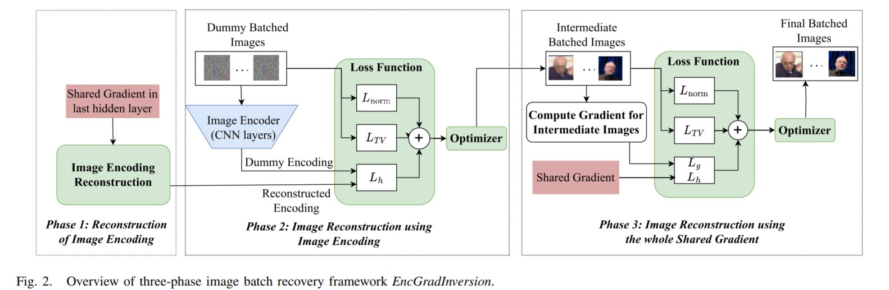
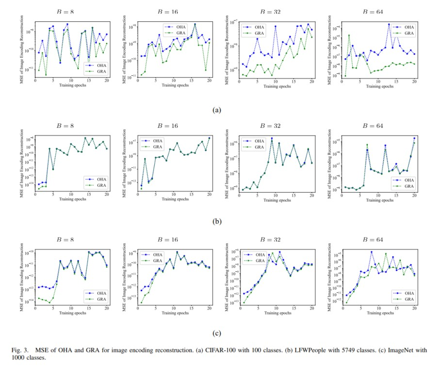
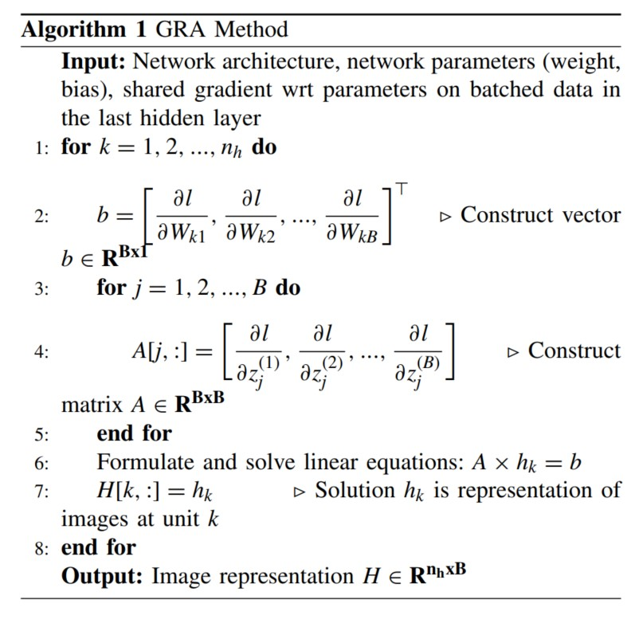
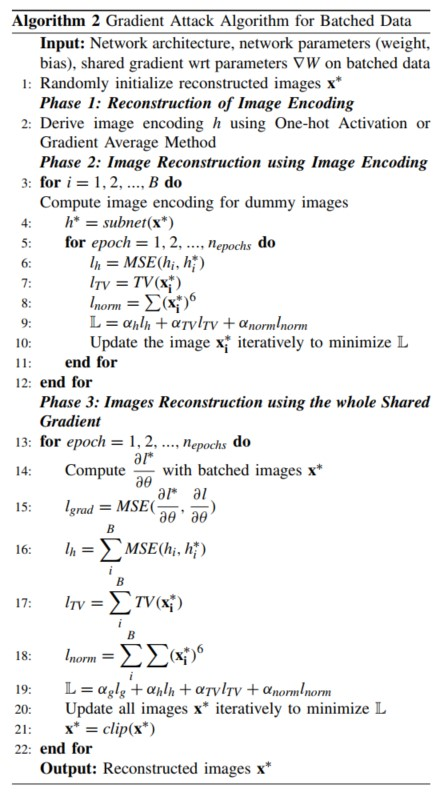
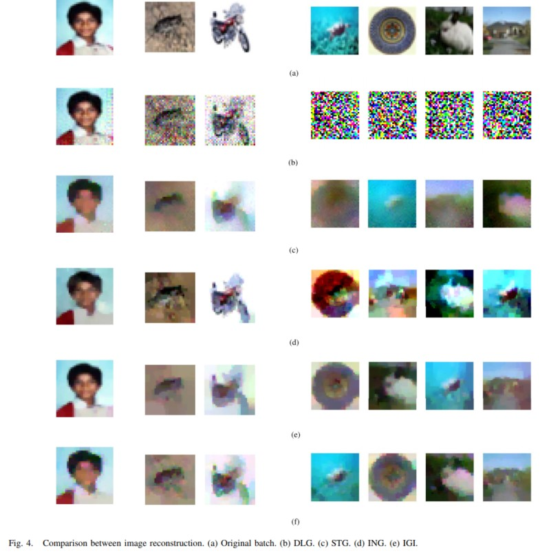
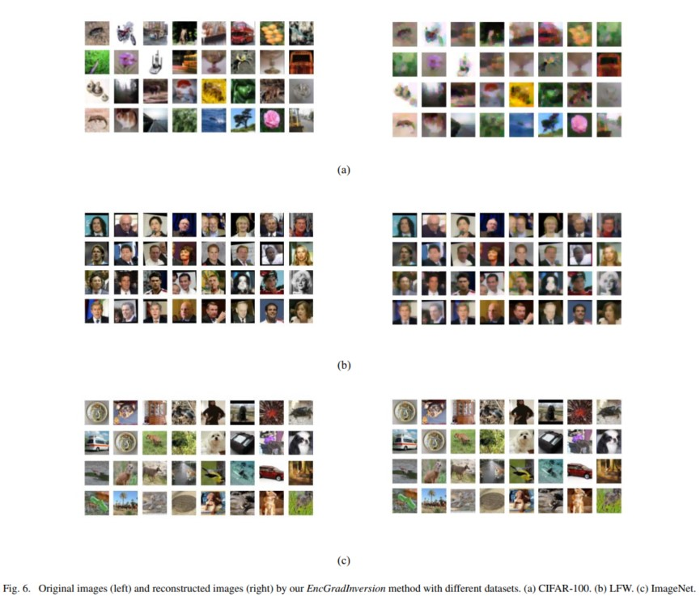
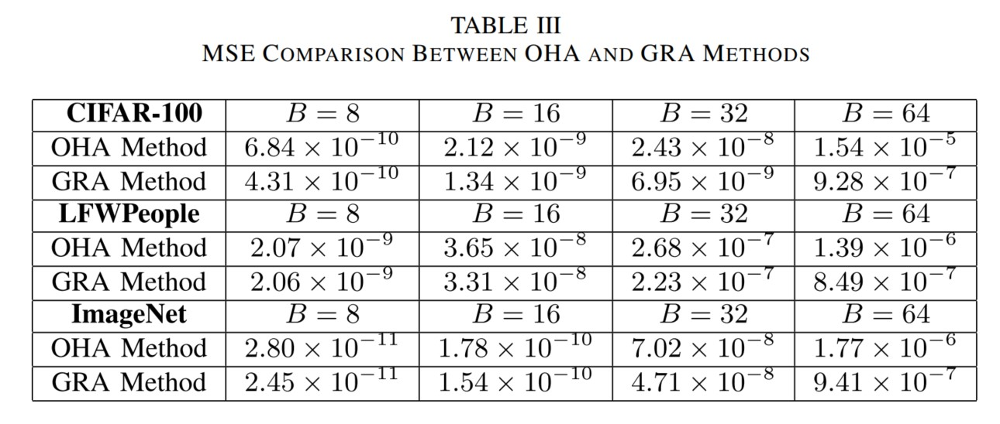
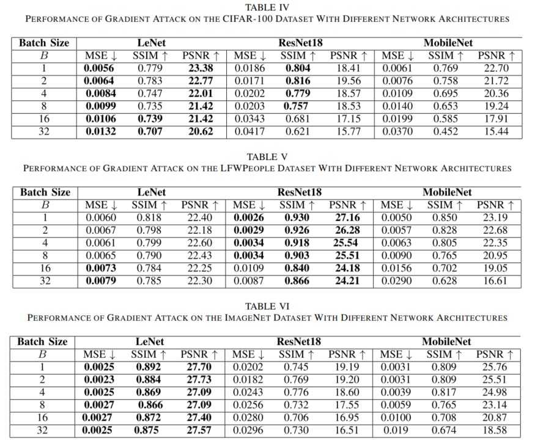
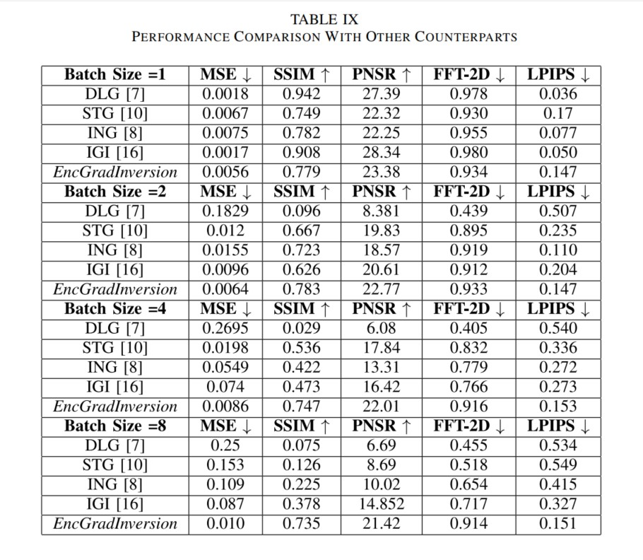

EncGradInversion
================

Reference paper:
EncGradInversion: Image Encoding and Gradient-Inversion-Based Batch Attack in Federated Learning
(IEEE IoT Journal, 2025).

```
@article{dao2025encgradinversion,
  title={EncGradInversion: Image Encoding and Gradient-Inversion-Based Batch Attack in Federated Learning},
  author={Dao, Thi-Nga and Lee, Hyungjune},
  journal={IEEE Internet of Things Journal},
  year={2025}
}
```

Motivation and Threat Model
---------------------------
Federated learning shares gradients rather than raw data, but shared gradients can leak sensitive inputs. 
EncGradInversion targets this risk by reconstructing training images from shared gradients under large batch sizes and high resolutions.

Threat model (adversary observes shared gradients during FL):
<p align="center">
  
</p>

Overview
--------
EncGradInversion is a three-phase batch image recovery pipeline:
1) Reconstruct image encodings from the last layer gradients (OHA or GRA).
2) Recover each image by matching its encoding with a dummy image (LBFGS + TV + norm).
3) Fine-tune the recovered images using full shared gradients.

This repo provides scripts to reproduce:
- OHA vs GRA encoding MSE (Table III).
- Gradient inversion attacks (DLG / IGI / ING / Ours) on CIFAR100, LFWPeople, ImageNet.

Illustrations
-------------
EncGradInversion pipeline (3-phase recovery). The method first estimates image encodings from last-layer gradients, then reconstructs each image by matching its encoding, and finally refines images with full-network gradients:
<p align="center">
  
</p>

Encoding reconstruction (OHA vs GRA). GRA solves a linear system to recover hidden representations, which is more robust to large batches than OHA:
<p align="center">
  
</p>

Algorithm 1 summarizes the GRA method for the image representation reconstruction. 
<p align="center">
  
</p>
 Algorithm 2 summarizes the entire procedure of the gradient attack algorithm.
<p align="center">
  
</p>

Additional results and comparisons. Qualitative comparisons across methods and settings:
<p align="center">
  
</p>
The quality of the reconstructed images by our EncGradInversion (with B = 32, compared to the original training images in three datasets in Fig. 6
<p align="center">
  
</p>
Comparison of attack time between gradient attack methods.
<p align="center">
  
</p>

Prerequisites
-------------
- Python 3.10+
- torch, torchvision, torchmetrics, matplotlib, numpy, scikit-image, pillow, torchsummary

Example install:
```
pip install torch torchvision torchmetrics matplotlib numpy scikit-image pillow torchsummary
```

Datasets
--------
1) CIFAR100
Auto-downloads into `~/.torch`.

2) LFWPeople (using local archive)
This repo uses the deepfunneled LFW archive already placed under:
```
./archive/lfw-deepfunneled/lfw-deepfunneled/
```
No torchvision download is required. The code reads images directly from this folder.

3) ImageNet
Create `./Imagenet/` and put images directly inside it.
You can download 1000 images of Imagenet dataset from here: https://github.com/EliSchwartz/imagenet-sample-images

Generate index lists (required by main_gradient_attack_iot24_round1.py)
----------------------------------------------------------------------
PowerShell (Windows):
```
@'
import numpy as np
a = np.random.randint(0, 50000, size=(10,128))
np.savetxt("index_list_cifar.txt", a, fmt="%d")
'@ | python -

@'
import numpy as np
a = np.random.randint(0, 13233, size=(10,128))
np.savetxt("index_list_LWF.txt", a, fmt="%d")
'@ | python -

@'
import numpy as np
a = np.random.randint(0, 500, size=(10,128))
np.savetxt("index_list_ImageNet.txt", a, fmt="%d")
'@ | python -
```

Bash:
```
python - <<'PY'
import numpy as np
a = np.random.randint(0, 50000, size=(10,128))
np.savetxt("index_list_cifar.txt", a, fmt="%d")
PY
```

OHA vs GRA (Table III)
----------------------
Run one batch size at a time and collect the mean values.
```
python h_diff_diff_batch_plot_server.py --dataset CIFAR100 --model LeNet --batch 64
```

Outputs:
- `B_<batch>_<dataset>.eps`
- `h_diff1.txt`, `h_diff2.txt`
- `table_ohagra.csv` (appends dataset,batch,mean_diff1,mean_diff2)

Gradient inversion attacks (Tables IV-IX)
-----------------------------------------
Example (CIFAR100, batch size 4):
```
python main_gradient_attack.py --attack Ours --dataset CIFAR100 --model LeNet --n_images 4 --n 0 --method 2
```

Replace `--attack` with `DLG`, `IGI`, or `ING`.
Replace `--dataset` with `LFWPeople` or `ImageNet`.
Replace `--model` with `ResNet18`, `MobileNet`, or `EfficientNet0` (when applicable).
Replace `--method` with `1` (OHA), `2` (GRA) (when applicable).
Outputs:
- `B_<n_images>_w_<w>_<dataset>_ours.eps`
- `B_<n_images>_w_<w>_<dataset>_original.eps`
- `Performance_metrics_<method>.txt`

Results
-------
Encoding reconstruction (OHA vs GRA):
`table_ohagra.csv` accumulates mean MSE for each dataset/batch.

Example:
```
dataset,batch,mean_diff1,mean_diff2
CIFAR100,8,6.84e-10,4.31e-10
CIFAR100,16,2.12e-09,1.34e-09
```
<p align="center">
  
</p>
Attack quality:
Each run appends to `Performance_metrics_<method>.txt` with:
```
a_g  a_h  a_tv  a_norm  MSE  SSIM  PSNR  FFT  LPIPS
```
Use these files to fill Tables IV-IX in the paper.

Result tables (from the paper figures in `assets/`):
<p align="center">
  
</p>
<p align="center">
  
</p>
<p align="center">
  
</p>
Interpretation (from the paper)
-------------------------------
- OHA vs GRA: MSE increases as batch size grows; GRA typically yields lower MSE than OHA for large batches.
- CIFAR100 vs LFWPeople vs ImageNet: higher resolution and larger batch sizes make reconstruction harder, reflected by higher MSE and lower SSIM/PSNR.
- EncGradInversion vs baselines: the proposed method improves SSIM and reconstruction speed, especially on large batches.

Qualitative results
-------------------
Recovered vs original samples (EPS files, view locally):
- `B_1_w_32_CIFAR100_ours.eps` vs `B_1_w_32_CIFAR100_original.eps`
- `B_4_w_32_CIFAR100_ours.eps` vs `B_4_w_32_CIFAR100_original.eps`

If you want GitHub preview, export EPS to PNG and place in `assets/`.

Notes
-----
- For GPU, enable CUDA by editing `device` in `main_gradient_attack.py`.
- Batch size is controlled by `--n_images`.
- If ImageNet is not available locally, use CIFAR100 or LFWPeople.
